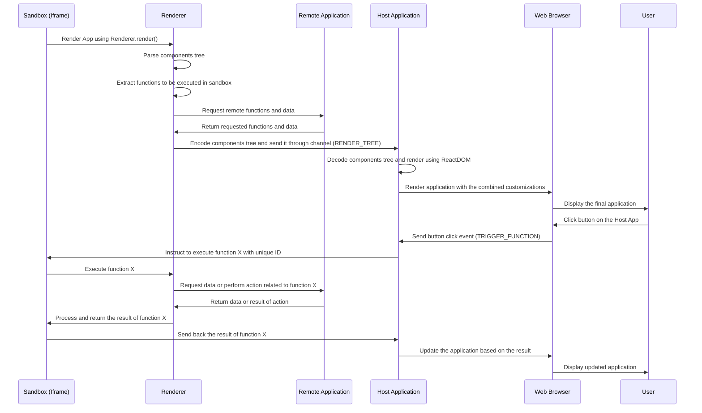

<samp>

# Sandboxing React components using Iframes (and Workers eventually)
> Playground for React remote rendering 🧪

```mermaid
sequenceDiagram
    participant Iframe as Sandbox (Iframe)
    participant Renderer as Renderer
    participant RemoteApp as Remote Application
    participant HostApp as Host Application
    participant Browser as Web Browser
    participant User as User

    Iframe->>Renderer: Render App using Renderer.render()
    Renderer->>Renderer: Parse components tree
    Renderer->>Renderer: Extract functions to be executed in sandbox
    Renderer->>RemoteApp: Request remote functions and data
    RemoteApp->>Renderer: Return requested functions and data
    Renderer->>HostApp: Encode components tree and send it through channel (RENDER_TREE)
    HostApp->>HostApp: Decode components tree and render using ReactDOM
    HostApp->>Browser: Render application with the combined customizations
    Browser->>User: Display the final application

    User->>Browser: Click button on the Host App
    Browser->>HostApp: Send button click event (TRIGGER_FUNCTION)
    HostApp->>Iframe: Instruct to execute function X with unique ID
    Iframe->>Renderer: Execute function X
    Renderer->>RemoteApp: Request data or perform action related to function X
    RemoteApp->>Renderer: Return data or result of action
    Renderer->>Iframe: Process and return the result of function X
    Iframe->>HostApp: Send back the result of function X
    HostApp->>Browser: Update the application based on the result
    Browser->>User: Display updated application
```
</samp>
